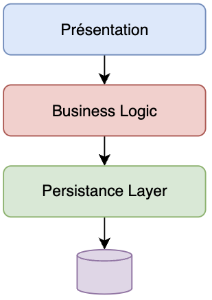
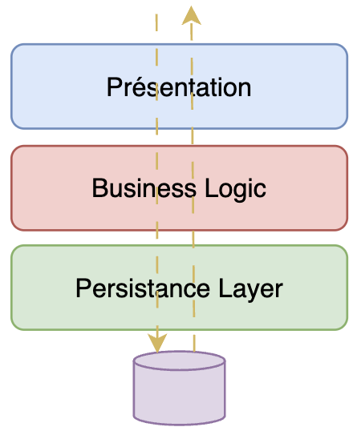

+++
title = "Layered"
weight = 10
+++

## Objectif du découpage
Le concept fondamentale de l'architecture n-tiers est le *Separation of Concern*. Les composants d'une couche spécifique ne traite que les informations spécifique à cette couche. Par exemple, l’IHM ne sait pas comment les utilisateurs sont récupérés de la base de données. 

Ensuite, cette architecture permet d'avoir un code facilement testable et maintenable. En effet des changements effectués sur une couche n'impacteront pas les autres couches, le changement est *isolé*.

## Sinkhole anti-pattern
Le principal risque de cette architecture s'est qu'une requête traverse toutes les couches sans qu'aucune business logic n'ait été appliquée.

Par conséquence, l'entité de la base de données est remonté directement à la couche de présentation. Or cette entité en base de données contient peut être plus d'informations que nécessaire à la vue.

