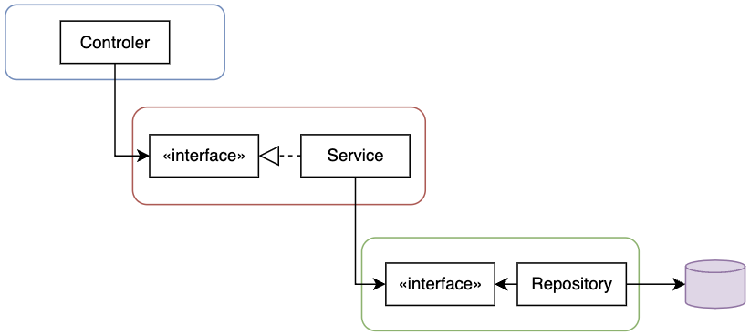
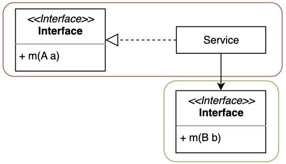

+++
title = "Layered (Couche)"
weight = 10
alwaysopen = false
+++

## Objectif du découpage
Le concept fondamentale de l'architecture n-tiers est le *Separation of Concern*. Les composants d'une couche spécifique ne traite que les informations spécifique à cette couche. Par exemple, l’IHM ne sait pas comment les utilisateurs sont récupérés de la base de données. 

Ensuite, cette architecture permet d'avoir un code facilement testable et maintenable. En effet des changements effectués sur une couche n'impacteront pas les autres couches, le changement est *isolé*.

## Couche fermée
{}
Les couches communiquent par le biais d'interfaces ou d'API bien définies, abstrayant les détails de la mise en œuvre de chaque couche.
{}
Pour éviter qu'une requête traverse toutes les couches [sinkhole antipattern]({}), nous appliquons de l'inversion de dépendances entre nos couches.

### Interface de contrat
Chaque couche définie son contrat au travers d'interfaces. 
1. Le Controller envoie une requête au service dont le contrat d'échange est `A`
2. Le Service doit transformer cette requête pour respecter le contrat d'échange avec le repository qui est `B`

En d'autre terme :
- `A` est le DTO de requête (car il peut y a voir un DTO de réponse) entre la *présentation* et la *business logic*. Le contrôler doit envoyer ses données sous le format `A`
- `B` est le DTO de requête (car il peut y a voir un DTO de réponse) entre la *business logic* et la *persistance* Le Service doit envoyer ses données sous le format `B`

## Layers of isolation

{}
Le concept de *Layers of isolation* signifie que les modifications apportées à une couche de l'architecture n'ont généralement pas d'impact ou d'incidence sur les composants des autres couches.
{}

Le point fort de l'architecture Layered est d'avoir des couches indépendantes des autres. Ainsi si l'on souhaite remplacer les technologie sur une couche (e.g. JSF par React.js) cela n'impactera pas les autres couches. 

## Conclusion

L'isolement favorisé dans cette architecture contribue à maintenir l'intégrité et la stabilité de la couche, la rendant moins sensible aux changements et aux perturbations causées par des facteurs externes. La maintenabilité et l'évolutivité de notre système sont grandement améliorées.
- chaque couhe ne communique qu'avec son n+1 ou n-1 - fermée
- chaque couche est totalement indépendante des autres - isolée