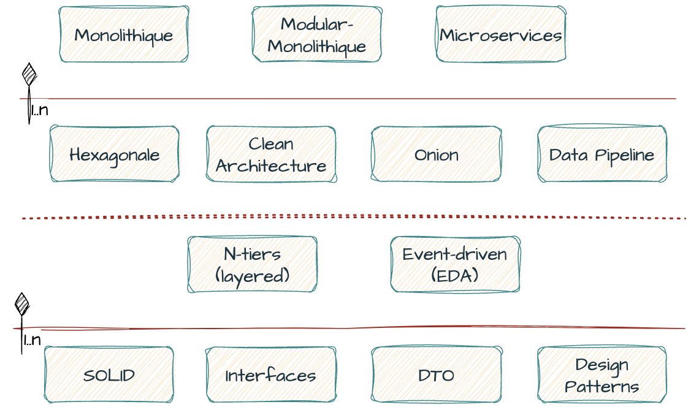

+++
title = "Patterns Level"
weight = 20
+++

{}
A reprendre par rapport au 3 sections précédente
{} 

{}
Afin de simplifier la suite du cours, j'ai pris le choix de découper les architectures suivants plusieurs couches. Ce découpage est arbitraire et n'a jamais été documenté.
{} 

## Couches

### Couche 1
Cette couche représente l'arhictecture macroscopique de notre application. Chaque de ces architectures s'appuie et mélange différentes architectures du niveau inférieur.
Par exemple, certain module du logiciel vont être conçu sur une *Clean Architecture* pour une communication synchrone, tandis que d'autre sur une architecute *Event-driven* pour les parties asynchrones.

De plus, nous allons par exemple assembler plusieurs architectures haxagonales pour former notre système. Ou, combiner plusieurs types d'architectures.

### Couche 2
La couche 2 représente un ensemble d'architecture permettant de créer un module unitairement. Cette couche peut être subdiviser en deux, choix arbitraire, par exemple une *Clean Architecture* se base sur une *n-tiers* architecture.

### Couche 3
On retrouve les concepts purement techniques ([Conception Logicielle]({})) qui permettent la réalisation d'un code de qualité. Ces concepts sont présents dans chaque architecture de la couche supérieure. Il est nécessaire de les matriser pour effectuer une bonne conception.

## Lien avec le C4 Model
Il y a un très fort lien avec le [C4 Model]({})  :
- La couche conteneurs qui montre la décomposition du système en conteneurs indépendants peut être associée à la couche 1
- La couche components qui est un regroupement de fonctionnalités peut être associée à une composinaison de patrons de couche 2 (e.g plusieurs architectures hexagonales)
- La couche technique peut être associée à la couche 3